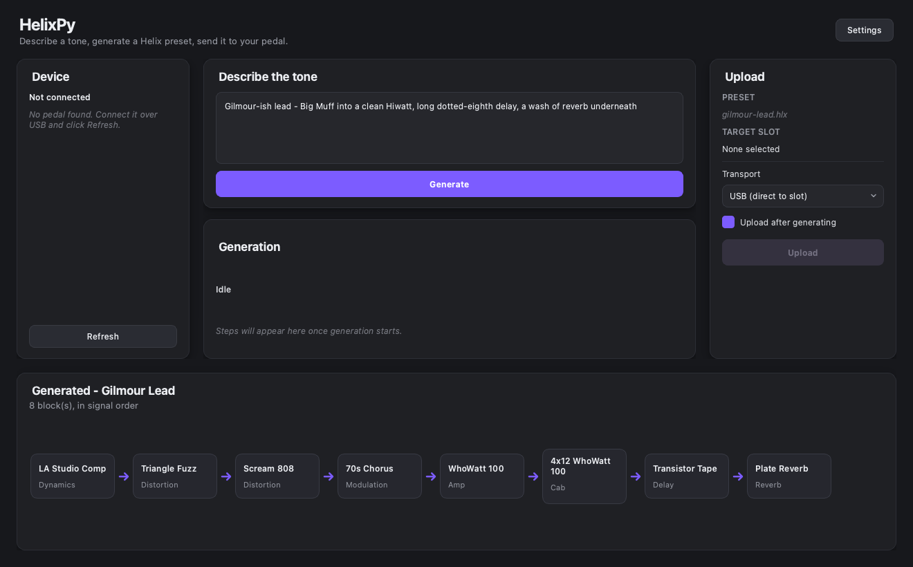

# HelixPy

[](https://github.com/ORogers/HelixPy/actions/workflows/ci.yml)
[](LICENSE)

**Describe a guitar tone in plain English. Get it on your Line 6 HX Stomp.**

HelixPy turns "warm, dark jazz tone - hollowbody into a small valve amp, light
compression, a short room reverb" into a real Helix preset, validates it
against the full model catalog, and writes it straight into a slot on your
pedal over USB. There is a desktop app and a command-line tool; both do the
same thing.



> **This writes to your pedal.** Take a backup before the first write -
> `hlxgen backup --output ~/helix-backup` copies every slot and sends the pedal
> nothing. Firmware, flash and DFU are out of scope and are never transmitted;
> everything HelixPy does is recoverable.

---

## Features

**Generating tones**

- **Plain-English prompts.** "Gilmour-ish lead - Big Muff into a clean Hiwatt,
  long dotted-eighth delay" is a valid input. Reference records, rigs and the
  sound you are after rather than block names.
- **The whole catalog.** All 343 HX Stomp models across 13 categories, 310 of
  them carrying the real amp or pedal they model, so a prompt naming a rig
  lands on the right thing.
- **Nothing invented.** Both model calls are constrained to a JSON schema built
  from the catalog: only real model names, only in-range values, only listed
  option labels. A rejected answer is re-asked once with the reason attached.
- **Two backends.** OpenAI by default - seconds per tone, better chains, a
  fraction of a penny each. Ollama for working offline and free, with nothing
  leaving your machine. Both offer a thinking level to trade speed for quality.

**Getting them onto the pedal**

- **Direct USB upload** into a slot you choose, reading the slot back
  afterwards to confirm the write landed.
- **Browse your pedal** from the app: what each slot holds, and the signal
  chain of any of them, read without loading the preset or moving the pedal's
  own panel.
- **Backups.** `hlxgen backup` copies all 126 slots and sends the pedal
  nothing; `push --archive` saves the target slot before it is overwritten.
- **Amps carry their own cab**, the way they do on the pedal, so a chain with
  an amp and six effects still fits in eight blocks. `--separate-cabs` if you
  would rather it did not.
- **Footswitches assigned for you** - three blocks get switches 1-3, drive,
  modulation and delay chosen first - and overridable per block.

**Working with preset files**

- **Hand-authored chains** in JSON or YAML, in a short form (a title and a list
  of model names) or a full one that reaches every parameter, footswitch and
  routing field.
- **Validation before anything is written**, structurally against a JSON schema
  and semantically against the catalog - every model real, every value in
  range. The same gate backs a standalone `hlxgen validate`.
- **Presets that import cleanly**, built from a known-good HX Stomp export so
  snapshots, global parameters and device identifiers match what HX Edit
  expects.
- **`hlxgen inspect`** to read any `.hlx` file as an ordered signal chain, and
  `hlxgen models` to list the catalog, filtered by category.

**Both ways in**

- **A desktop app** for the whole flow - pick a slot, describe, preview,
  upload - with a first-run setup that takes your API key and remembers it.
- **A command-line tool** covering the same flow, plus what the app has no
  screen for: reading presets off the pedal, hand-authored chain files, and
  auditing the catalog against your own HX Edit install.

## Install

**The app** - download the `.dmg` from [Releases][releases], drag HelixPy to
Applications, then **right-click it and choose Open** the first time.
([Why?](docs/install.md#why-macos-warns-you))

[releases]: https://github.com/ORogers/HelixPy/releases

**The command line**

```bash
pipx install 'helixpy[usb]'   # plus: brew install libusb
```

You will also need **HX Edit** installed to reach the pedal, and an
**OpenAI API key** to generate anything - the app asks for one the first time
it opens, and saves it. Prefer to stay offline? **Ollama** works too, free and
locally. [Full setup →](docs/guide.md#1-what-you-need)

## Try it

```bash
hlxgen backup --output ~/helix-backup          # once, before anything else
hlxgen describe "spacious ambient clean, long decay"
hlxgen describe "tight prog metal rhythm" --upload --upload-via usb --slot 4
```

Or open the app, pick a slot, type what you want, press Generate.

**[Read the guide →](docs/guide.md)**

## How it works

A tone request becomes a preset in two model calls, however long the chain:

1. **Blocks.** The prompt carries the signal-chain rules, two worked examples,
   and the whole catalog as one `name - based on` line per model. The model
   picks the chain.
2. **Parameters.** A second call sets every block at once, so gain and levels
   are balanced across the chain rather than block by block.

Both answers are constrained to a JSON schema built from the catalog: only real
model names, only in-range values, only listed option labels. Anything still
wrong is re-asked once with the reason attached, and the assembled preset is
validated against the schema *and* the catalog before a byte reaches disk.

Uploading uses a reverse-engineered USB protocol that writes into a chosen slot
and reads back to confirm. [The full trace →](docs/application_flow.md)

## Supported hardware

| | |
| --- | --- |
| **HX Stomp** | Verified. This is what it was built and tested against. |
| Other Helix / HX devices | Untested. The protocol should be the same, but nobody has confirmed it. |

If you have another unit, [a device report](https://github.com/ORogers/HelixPy/issues/new/choose)
is genuinely useful - including one that just says it worked.

## Documentation

| | |
| --- | --- |
| [Guide](docs/guide.md) | Install, first tone, writing good prompts, troubleshooting. |
| [CLI reference](docs/cli.md) | Every command and flag. |
| [Application flow](docs/application_flow.md) | How it works, end to end. |
| [USB protocol](docs/usb_upload_plan.md) | The research behind the device support. |
| [Legal](docs/legal.md) | Trademarks, and which data files are and are not distributed. |
| [Contributing](CONTRIBUTING.md) | Setup, the checks CI runs, house rules. |

## Licence and attribution

Apache-2.0. See [LICENSE](LICENSE) and [NOTICE](NOTICE).

Helix, HX Stomp, HX Edit and Line 6 are trademarks of Yamaha Guitar Group /
Line 6. This project is independent and unaffiliated; it contains no Line 6
source, firmware or SDK, and does not redistribute Line 6's data files.
[The full statement →](docs/legal.md)

Much of the protocol work is distilled from
[**fretwire**](https://github.com/john-baxter-dev/fretwire), whose living
protocol and preset-format specs did the hard part first.
