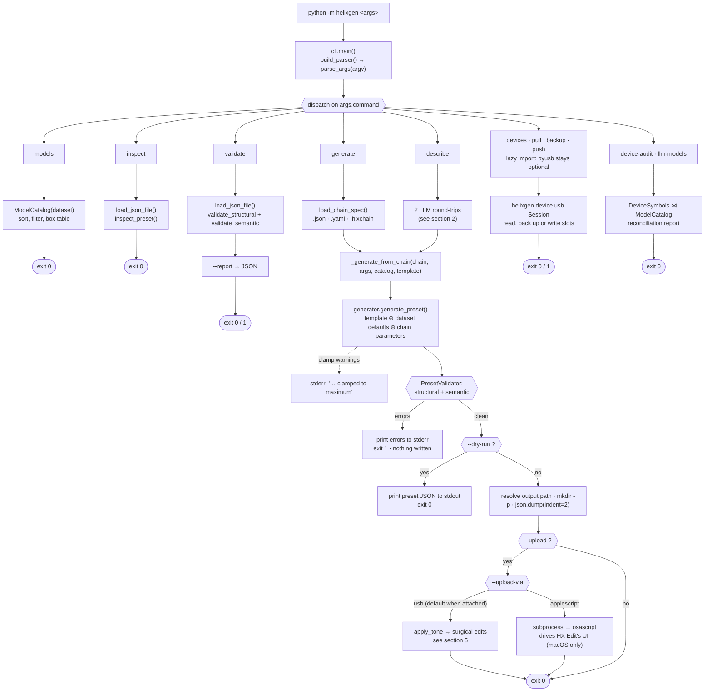
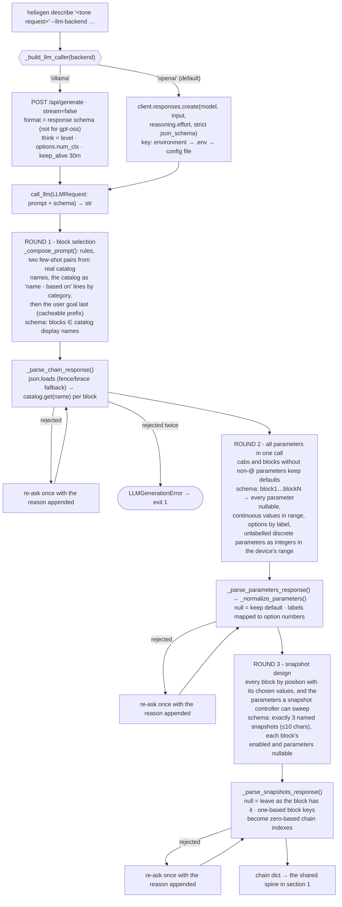
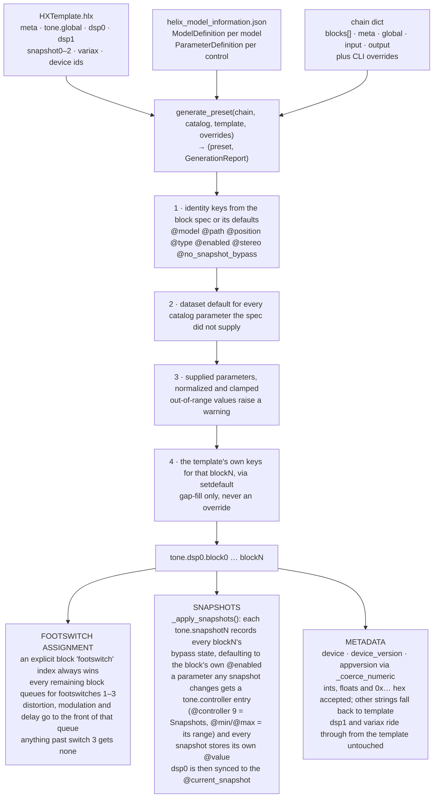
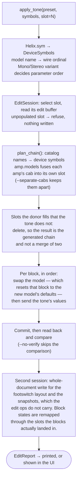
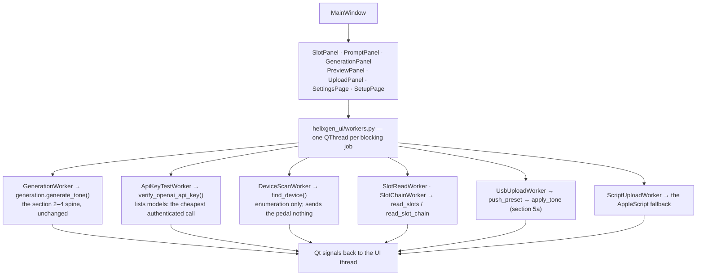

# How HelixGen currently works

A trace of every path an invocation can take, from `helixgen` on the command line or
a click in the desktop app, to a written `.hlx` file and a slot on the pedal.

Two front ends share one engine. `helixgen` is a single-process CLI: every invocation
loads its data files, does one job, prints to stdout/stderr, and exits. The desktop
app (`helixgen_ui`) is long-lived, runs its blocking work on Qt threads, and caches
what a slot read would otherwise pay for twice — but it calls the same functions,
never the CLI, and never a subprocess.

There is one persistent piece of state in either: `helixgen/config.py`, a small JSON
file holding what a person set once and should not have to set again - where HX Edit
was found, the desktop app's settings, and the OpenAI key. Everything else is an
argument or a file path.

## Data inputs

The first three ship inside the package (`helixgen/data/`) and are resolved through
`helixgen.resources`, so they are found wherever helixgen is installed rather than
relative to the working directory. The last two are Line 6's, are **not**
distributed, and are read from the user's own HX Edit install — see
[legal.md](legal.md).

| File | Loaded by | What it decides |
| --- | --- | --- |
| `helix_model_information.json` | `ModelCatalog` | Which models exist, their internal names, categories, and every parameter's type, range, default and option map. Nothing else may name a model. **An option map is keyed by the number the device stores**, not by the option's position in HX Edit's display list - several lists do not start at zero. |
| `HXTemplate.hlx` | `load_json_file` | The structural skeleton every generated preset is deep-copied from: `meta`, `tone.global`, `dsp0`, `dsp1`, `snapshot0–2`, `variax`, and the HX Stomp device IDs. |
| `helix-preset.schema.json` | `PresetValidator` | The structural contract checked before any file is written — required `meta` keys, `tone.global.@tempo`, and `dsp0.inputA` / `outputA`. |
| `Helix.sym` (in HX Edit) | `DeviceSymbols` | The array position of each model *is* its identity on the wire, and each variant's parameter order. Required by every device operation; located by `helixgen/device/hxedit.py`. |
| `amp.models` (in HX Edit) | `AmpDefaults` | Which cab each amp carries in its own slot. Optional — without it an amp keeps a separate cab block. |

## 1. Entry and dispatch

`helixgen/__main__.py` imports `helixgen.main`, which forwards to `cli.main()`; an
installed copy reaches the same place through the `helixgen` console script.
`build_parser()` builds one `argparse` parser with a required subcommand, then
`main()` dispatches on `args.command` (`cli.py:main`) across **eleven** commands.
`generate` and `describe` differ only in how they obtain a chain dictionary; from
there they share one code path.

The four device commands — `devices`, `pull`, `backup`, `push` — are dispatched
through a function-local import of `helixgen.device.commands`, which is what keeps
pyusb an optional dependency: the plain CLI never imports it. `--hx-edit`, if
given, is validated and applied to the environment before any command runs, so no
handler has to carry a path for the one run where HX Edit is somewhere unusual.



Output paths: `generate` writes `<chain>.hlx` beside the chain file, `describe`
writes to `resources.default_output_dir()` — `./generated-presets/` from a shell,
`~/Documents/HelixGen/presets/` inside a frozen app bundle, which has no meaningful
working directory. Either is overridden by `--output`.

## 2. Getting a chain dictionary

A "chain" is a plain dict with an ordered `blocks` list plus optional `meta`,
`global`, `input` and `output` sections. `generate` reads one off disk — `.json` and
`.hlxchain` go through `json.load`, `.yaml`/`.yml` go through PyYAML, and any other
suffix is rejected before the file is opened.

`describe` synthesises one instead, and this is where the tool spends nearly all of
its wall-clock time. The desktop UI (`helixgen_ui.generation.generate_tone`) takes the
same path. It makes **three model calls** however long the chain is: one to pick the
blocks, one to set every block's parameters, and one to design the preset's three
snapshots. All three go through the same `call_llm` closure, so the backend, model
and thinking level apply to every round.



The catalog is the only authority on names: the schema only admits catalog names,
and a name that still slips through (gpt-oss on Ollama runs without a schema,
because Ollama 0.33 returns empty text for it whenever one is set) is re-asked once
and then aborts the run before a preset is built. Every call is timed; the Ollama
and OpenAI token counts are logged, and the UI's Generation panel shows each
round's duration.

## 3. Assembling the preset

`generate_preset()` is where the three data sources meet. It deep-copies the
template, then writes a `block0…blockN` payload into `tone.dsp0` for each entry in
the chain. The order the four value sources are applied in is the whole mechanism —
in particular, the template's own keys for a given block are applied **last** and
only via `setdefault`, so they fill gaps rather than override anything you or the
model chose.



Only `dsp0` is ever rebuilt: a chain cannot currently place blocks on the second
signal path.

### Snapshots

A chain may carry a `snapshots` list, one entry per template snapshot (three on HX
Stomp). Each entry has an optional `name` (the device shows at most 10 characters;
longer ones are truncated with a warning) and a `blocks` map keyed by the block's
zero-based index in the chain:

```json
"snapshots": [
  {"name": "Clean", "blocks": {"1": {"enabled": false}, "2": {"parameters": {"Drive": 0.2}}}},
  {"name": "Rhythm"},
  {"name": "Solo", "blocks": {"4": {"enabled": true, "parameters": {"Mix": 0.35}}}}
]
```

The block's own `enabled` and `parameters` are the baseline; a snapshot lists only
what it changes. This mirrors how HX Edit stores them: every block's bypass state
lives in `snapshotN.blocks.dsp0`, and a parameter becomes snapshot-controlled
through a `tone.controller.dsp0.blockN.<param>` entry with `@controller: 9`, after
which every snapshot holds its own `@value` in `snapshotN.controllers`. A parameter
whose range the catalog does not know cannot carry a controller and is rejected, as
is a bypass change on a block marked `no_snapshot_bypass`. A chain without
`snapshots` gets the template's, with each block's `@enabled` copied in.

## 4. The validation gate

Nothing reaches disk unvalidated. `PresetValidator` runs two independent passes over
the assembled preset and concatenates their errors; a single error is enough to print
to stderr and exit 1 with no file written. The same validator backs the standalone
`validate` subcommand, so a generated preset and a hand-written one are held to
identical standards.

| Pass | Reads | Rejects |
| --- | --- | --- |
| `validate_structural` | `helix-preset.schema.json`, through `SimpleSchemaValidator` — a hand-rolled subset supporting `type`, `required`, `properties`, `additionalProperties`, `items` and `minItems` | A missing `meta.application`, `meta.appversion`, `meta.name`, `tone.global.@tempo`, `@current_snapshot`, `dsp0.inputA` or `dsp0.outputA`; wrong JSON types. Booleans are deliberately not counted as numbers. |
| `validate_semantic` | The model catalog, walking every entry in `tone.dsp0`, `tone.controller` and each `tone.snapshotN` | A block whose `@model` is absent from the catalog, any non-`@` key that is not a real parameter of that model, or a value the parameter definition refuses to normalize. Snapshot bypass states and controller values must name blocks that exist, and every snapshot value needs a matching `tone.controller` assignment. Names starting `HelixStomp_AppDSPFlow` or `HD2_AppDSPFlow` are treated as routing infrastructure and skipped, which is how `inputB`/`outputB` pass without catalog entries. |

## 5. Writing out, and getting it onto the pedal

With the gate cleared, `--dry-run` prints the preset as indented JSON and stops.
Otherwise the output path resolves, parent directories are created, and the preset is
written with `json.dump(indent=2)`. Whatever happens next, the file is already safely
on disk — every upload failure is reported against a preset that still exists.

Two transports can follow. `--upload-via` picks one; left off, it takes USB when a
device is attached and falls back to the AppleScript uploader otherwise.

### 5a. USB — the real path

`helixgen push`, `generate/describe --upload-via usb`, and the desktop app's Upload
button all converge on `helixgen.device.editor.apply_tone`. It is the only transport
that can change a block's **model**, which is exactly what a freshly generated preset
does to whatever was in the slot.

Underneath it, `helixgen/device/usb.py` opens **interface 0 only** — the audio and MIDI
interfaces are left alone — and runs one strictly synchronous request/response
channel. Three properties of the device shape that layer:

* **Nothing is pipelined.** One request, one response.
* **Replies are matched by the transaction id echoed at MessagePack key 102**, never
  by arrival order. The device interleaves keepalives, flow-control credits and
  leftover stream chunks on the same channel, and taking one of those for an
  acknowledgement mis-attributes every later reply.
* **A dropped handle can leave the pedal's front panel locked**, which is why the
  session is closed politely on the way out and the context manager is the intended
  way in. Every bulk operation carries a timeout, because an unbounded write to a
  device that has stopped draining its OUT endpoint blocks forever.



Positions are assigned in chain order rather than taken from the tone's own
`@position`: fusing a cab into its amp closes a gap, and leaving one would waste the
slot the fusion just freed.

The layout write is a second session on purpose: the edit run above has spent most of
its frame budget, and this is another dozen frames on top of a full read. It is also
the only write that is safe to send whole, because by that point no model is changing.
Snapshot names, tempos and valid flags go back as the preset has them, while each
snapshot's per-block on/off states are looked up through `placed` — a switch or a
snapshot state bound to `dsp0.block2` has to reach whichever device slot that block
actually occupies, and the two are independent on the wire.

`--archive` writes the slot's current contents out before overwriting it. `helixgen
backup` and `helixgen pull` are the read-only halves of the same transport.

**Firmware, flash and DFU are out of scope and are never transmitted.** See
[`usb_protocol.md`](usb_protocol.md) §7 for the rest of the safety rules.

### 5b. AppleScript — the fallback

`--upload-via applescript` predates the USB work and survives as a fallback. It is
macOS-only, cannot read anything back, and cannot target a slot: there is no API
here, only HX Edit's own user interface driven through System Events on fixed
delays.

1. `activate` — bring HX Edit to the front, then wait 3 seconds for it to settle.
2. In `manual` mode, show a dialog and pause so the user can highlight the target
   slot; in `auto` mode, press the first row of the preset outline, then `⌘↑` and
   Return to select slot 1 — overwriting it.
3. `⌘I` — open HX Edit's *Import Preset…* sheet.
4. `⌘⇧G` — open the macOS *Go to Folder* field.
5. Type the preset's absolute path, then Return to accept it.
6. Three further Returns: dismiss the sheet, choose the file, confirm the import.

If any step fails, `_generate_from_chain` catches it, prints `Upload failed: …` and
returns 1.

## 6. The desktop app

`helixgen_ui` is a PySide6 window over the same engine. It deliberately does **not**
shell out to `helixgen`, and does not call `cli._generate_from_chain` either — that
function prints its result and returns an exit code, which a UI would have to scrape.
`helixgen_ui/generation.py` calls the same underlying pieces the `describe` command
calls and hands back a typed `GenerationResult`.



Three things about it are not obvious from the signatures:

- **Every live worker is held in a module-level set** (`workers._LIVE_WORKERS`).
  Destroying a `QThread` while its thread is still running aborts the process, and at
  interpreter teardown Python will happily collect a worker whose only reference was
  a closed window's attribute.
- **Three of the four costs in a slot read never change between clicks**, so
  `helixgen_ui/device.py` caches them: `_SYMBOLS_CACHE` (the symbol table),
  `_CATALOG_CACHE` (the model catalog) and `_LISTING_CACHE` (the bank's name
  listing). Only the document itself comes off the wire each time. `invalidate_caches`
  drops the listing after an upload, because an upload is the one thing that renames
  a slot.
- **Upload is gated on finding HX Edit**, not on attempting it. `SettingsPage`
  re-runs discovery whenever it opens and emits `hx_edit_changed`; without an install
  the Upload button is disabled and says why, and auto-upload declines rather than
  failing inside the worker.

Settings are written to `helixgen/config.py`'s file on every change, so a choice made
once survives a restart. Each field is validated on its own type when read back, so
an outdated config costs the one setting it got wrong rather than resetting
everything.

**First run.** OpenAI is the default backend and it needs a key. With no key and no
backend chosen, `MainWindow` opens on `SetupPage` instead of the workspace: what the
two backends cost, how to make a key, a field to paste it into, and a "Use Ollama
instead" button that records that choice so the page does not return. Pressing
Generate without a key routes there too, rather than spending a round trip to fail
on a key that was never set.

## The read-only commands

Five subcommands never write anything:

- `models` loads the catalog, optionally filters on an exact case-insensitive
  category match, and prints a box-drawn table of display name, internal ID and
  real-world reference.
- `inspect` loads a preset, resolves each `tone.dsp0` block back through the catalog,
  and prints the chain sorted by `@position`. Unresolvable models are shown as-is
  under the type `Unknown` rather than failing. Note that `inspect` declares its own
  `--dataset` flag, so both `helixgen inspect p.hlx --dataset X` and
  `helixgen --dataset X inspect p.hlx` are valid, and the subcommand's value wins.
- `validate` runs the gate from section 4 on an existing file and can write its
  findings as JSON with `--report`.
- `llm-models` lists what the chosen backend offers — a fixed tuple for OpenAI, and
  whatever the Ollama server reports as installed — with the thinking levels each
  one supports.
- `device-audit` reconciles the catalog against `Helix.sym` from the user's HX Edit
  install: which models resolve, which the device splits into Mono and Stereo
  variants, and whose parameter lists do not line up. It always exits 0, because a
  real symbol table carries host-only models that legitimately have no device symbol,
  so the findings are reported rather than turned into a failure.

`devices` is nearly read-only: plain enumeration sends the pedal nothing at all, and
only `--identify` opens a session. `pull` and `backup` read slots without writing.

## Behaviour that isn't visible in the signatures

- **Return codes are discarded under `python -m helixgen`.** `__main__.py` calls
  `helixgen.main()`, which calls `cli.main()` and drops its integer result. Only
  `python helixgen/cli.py` wraps it in `SystemExit`. Argparse's own failures still
  exit 2, because `parser.error()` exits directly.
- **`ModelCatalogError` and `ValidationError` surface as argparse errors.** `main()`
  catches both and routes them to `parser.error()`, so a missing dataset, a malformed
  chain or an unknown model in a hand-written chain prints usage and exits 2 — while
  an LLM failure, caught separately in `run_describe`, exits 1.
- **A non-numeric `--device` silently falls back.** The string lands in `meta.device`
  as written, but it is also a candidate for the numeric `data.device` field;
  `_coerce_numeric` accepts ints, floats and `0x…` hex, and returns the template's
  value for anything else rather than raising.
- **An option's label and its stored number are not the same thing.** The catalog's
  option maps are keyed by the value the device stores, which is the parameter's own
  `min` plus the option's position in HX Edit's display list - and several lists do
  not start at zero. A delay's note sync runs 1..19, so the dotted eighth at display
  position 7 is stored as 8; 7 is the quarter triplet. Nothing complains about the
  wrong one, because it is still a valid option, which is why this was only found by
  checking 32 HX Edit-written presets.
- **A discrete parameter with no labels is validated against its range** rather than
  passed through unchecked, and the LLM schema constrains it to an integer within
  that range instead of any number.
- **Enum defaults are guessed when the dataset omits one.**
  `ParameterDefinition.default_value()` prefers an option labelled `False`, then one
  labelled `Off`, then the first entry in the forward map.
- **The OpenAI client is a module-level singleton.** `_OPENAI_CLIENT` is built on
  first use and reused for the rest of the process, so the key is resolved once per
  run. `store_openai_api_key` drops it, because a key changed in a running app
  would otherwise be ignored until the next launch.
- **The API key has three sources, most specific first**: `OPENAI_API_KEY` in the
  environment, a `.env` file found by walking up from the working directory, then
  `helixgen/config.py`'s file. The environment winning is what lets a shell override a
  saved key for one run; the config file is what lets an app launched from the Dock,
  with no environment at all, have a key in the first place. It is stored in plain
  text in a file created `rw-------`.
- **Cab blocks are never parameterised by the model.** Any model whose category
  contains "cab" keeps its dataset defaults; their controls (and the IR slot lists)
  rarely carry the tone request.
- **HX Edit is found once and remembered.** `helixgen/device/hxedit.py` tries an
  explicit path, `HELIXGEN_HX_EDIT`, a path remembered in `helixgen/config.py`, the two
  standard `/Applications` locations, then Spotlight by bundle id. A remembered path
  is re-validated on every use, so an install that moved falls through to a fresh
  search rather than pinning the app to a dead path, and an install is recognised by
  the presence of `Helix.sym` rather than by its name.
- **A missing `amp.models` is not fatal.** Without it an amp simply keeps its cab in
  a separate block, which is what the tone already describes. A missing `Helix.sym`
  is fatal to anything touching the device, because nothing can be addressed without
  it.

## Exit codes

| Code | Raised by | Meaning |
| --- | --- | --- |
| 0 | every `run_*` on success | Table printed, preset valid, or preset written (and uploaded). |
| 1 | `run_validate`, `_generate_from_chain`, `run_describe`, the device commands | Validation errors, an LLM failure, no device, no HX Edit install, or a failed upload. |
| 2 | `parser.error()` | Bad arguments, a missing dataset or schema, or a chain the generator rejects outright. |

## CI

`.github/workflows/ci.yml` runs four jobs against Python 3.13:

- **tests** — the pytest suite, headless via `QT_QPA_PLATFORM=offscreen`.
- **cli round-trip** — installs the built package, runs from a directory that is not
  the checkout (which is what catches a path silently resolving against the working
  directory), then generates and validates every chain in `docs/examples/`.
- **lint** — `ruff check` pinned to a fixed version so a ruff release can't fail the
  build on its own.
- **build** — builds the wheel and sdist and fails if a data file has fallen out of
  the wheel, since that installs cleanly and then breaks on first use.

Nothing in CI touches an LLM backend, a USB device or an HX Edit install — the
`describe` path is covered by the unit tests' stubs, and the device tests drive the
codec, framing and document parsing against fixtures.
