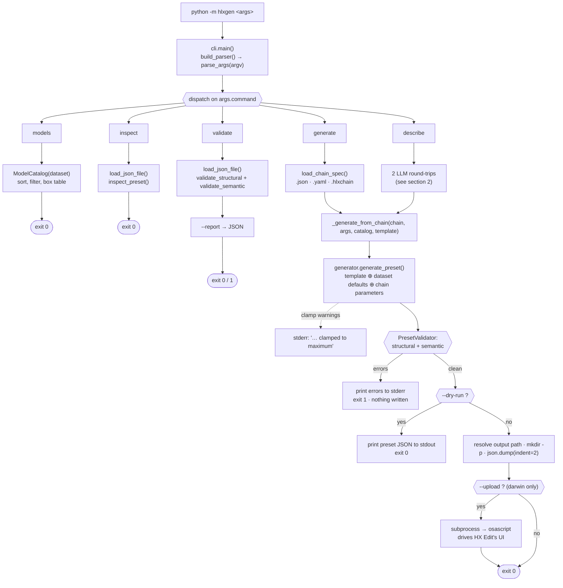
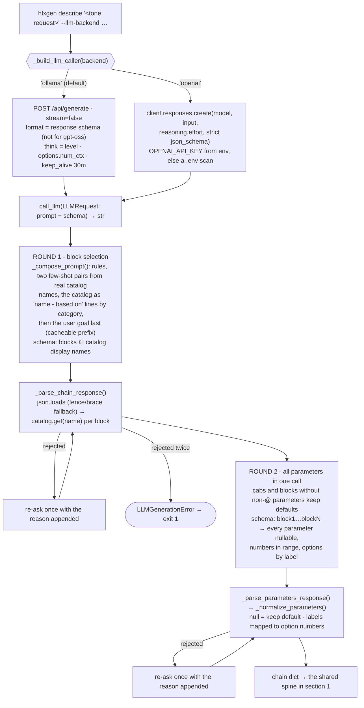
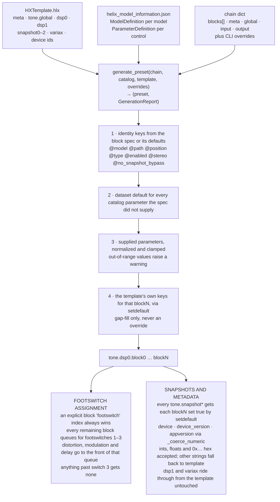

# How `hlxgen` currently works

A trace of every path an invocation can take, from `python -m hlxgen` to a written
`.hlx` file — and, on macOS, to a preset slot inside HX Edit.

`hlxgen` is a single-process CLI with no persistent state. Every invocation loads its
data files from disk, does one job, prints to stdout/stderr, and exits. There is no
server, no cache and no config file: everything is an argument or a file path.

## Data inputs

| File | Loaded by | What it decides |
| --- | --- | --- |
| `helix_model_information.json` | `ModelCatalog` | Which models exist, their internal names, categories, and every parameter's type, range, default and enum map. Nothing else may name a model. |
| `HXTemplate.hlx` | `load_json_file` | The structural skeleton every generated preset is deep-copied from: `meta`, `tone.global`, `dsp0`, `dsp1`, `snapshot0–2`, `variax`, and the HX Stomp device IDs. |
| `helix-preset.schema.json` | `PresetValidator` | The structural contract checked before any file is written — required `meta` keys, `tone.global.@tempo`, and `dsp0.inputA` / `outputA`. |

## 1. Entry and dispatch

`hlxgen/__main__.py` imports `hlxgen.main`, which forwards to `cli.main()`.
`build_parser()` builds one `argparse` parser with a required subcommand, then
`main()` dispatches on `args.command` to one of five `run_*` functions. `generate`
and `describe` differ only in how they obtain a chain dictionary; from there they
share one code path.

Output paths: `generate` writes `<chain>.hlx` beside the chain file, `describe`
writes `./generated-presets/<slugified-preset-name>.hlx`. Either is overridden by
`--output`.

## 2. Getting a chain dictionary

A "chain" is a plain dict with an ordered `blocks` list plus optional `meta`,
`global`, `input` and `output` sections. `generate` reads one off disk — `.json` and
`.hlxchain` go through `json.load`, `.yaml`/`.yml` go through PyYAML, and any other
suffix is rejected before the file is opened.

`describe` synthesises one instead, and this is where the tool spends nearly all of
its wall-clock time. The desktop UI (`hlxgen_ui.generation.generate_tone`) takes the
same path. It makes **two model calls** however long the chain is: one to pick the
blocks, then one to set every block's parameters. Both go through the same
`call_llm` closure, so the backend, model and thinking level apply to both rounds.

The catalog is the only authority on names: the schema only admits catalog names,
and a name that still slips through (gpt-oss on Ollama runs without a schema,
because Ollama 0.33 returns empty text for it whenever one is set) is re-asked once
and then aborts the run before a preset is built. Every call is timed; the Ollama
and OpenAI token counts are logged, and the UI's Generation panel shows each
round's duration.

## 3. Assembling the preset

`generate_preset()` is where the three data sources meet. It deep-copies the
template, then writes a `block0…blockN` payload into `tone.dsp0` for each entry in
the chain. The order the four value sources are applied in is the whole mechanism —
in particular, the template's own keys for a given block are applied **last** and
only via `setdefault`, so they fill gaps rather than override anything you or the
model chose.

Only `dsp0` is ever rebuilt: a chain cannot currently place blocks on the second
signal path.

## 4. The validation gate

Nothing reaches disk unvalidated. `PresetValidator` runs two independent passes over
the assembled preset and concatenates their errors; a single error is enough to print
to stderr and exit 1 with no file written. The same validator backs the standalone
`validate` subcommand, so a generated preset and a hand-written one are held to
identical standards.

| Pass | Reads | Rejects |
| --- | --- | --- |
| `validate_structural` | `helix-preset.schema.json`, through `SimpleSchemaValidator` — a hand-rolled subset supporting `type`, `required`, `properties`, `additionalProperties`, `items` and `minItems` | A missing `meta.application`, `meta.appversion`, `meta.name`, `tone.global.@tempo`, `@current_snapshot`, `dsp0.inputA` or `dsp0.outputA`; wrong JSON types. Booleans are deliberately not counted as numbers. |
| `validate_semantic` | The model catalog, walking every entry in `tone.dsp0` | A block whose `@model` is absent from the catalog, any non-`@` key that is not a real parameter of that model, or a value the parameter definition refuses to normalize. Names starting `HelixStomp_AppDSPFlow` or `HD2_AppDSPFlow` are treated as routing infrastructure and skipped, which is how `inputB`/`outputB` pass without catalog entries. |

## 5. Writing out, and the HX Edit handoff

With the gate cleared, `--dry-run` prints the preset as indented JSON and stops.
Otherwise the output path resolves, parent directories are created, and the preset is
written with `json.dump(indent=2)`.

Only `describe --upload` goes further. The CLI checks `sys.platform == "darwin"`,
locates `osascript` on `PATH`, and runs `scripts/import_helix_preset.applescript`
with the preset path and a mode. There is no API here — the script drives HX Edit's
actual user interface through System Events, on fixed delays:

1. `activate` — bring HX Edit to the front, then wait 3 seconds for it to settle.
2. In `manual` mode, show a dialog and pause so the user can highlight the target
   slot; in `auto` mode, press the first row of the preset outline, then `⌘↑` and
   Return to select slot 1 — overwriting it.
3. `⌘I` — open HX Edit's *Import Preset…* sheet.
4. `⌘⇧G` — open the macOS *Go to Folder* field.
5. Type the preset's absolute path, then Return to accept it.
6. Three further Returns: dismiss the sheet, choose the file, confirm the import.

If any step fails, `_generate_from_chain` catches it, prints `Upload failed: …` and
returns 1 — the preset file itself is already safely on disk by then.

## The read-only commands

Three subcommands never write a preset:

- `models` loads the catalog, optionally filters on an exact case-insensitive
  category match, and prints a box-drawn table of display name, internal ID and
  real-world reference.
- `inspect` loads a preset, resolves each `tone.dsp0` block back through the catalog,
  and prints the chain sorted by `@position`. Unresolvable models are shown as-is
  under the type `Unknown` rather than failing. Note that `inspect` declares its own
  `--dataset` flag, so both `hlxgen inspect p.hlx --dataset X` and
  `hlxgen --dataset X inspect p.hlx` are valid, and the subcommand's value wins.
- `validate` runs the gate from section 4 on an existing file and can write its
  findings as JSON with `--report`.

## Behaviour that isn't visible in the signatures

- **Return codes are discarded under `python -m hlxgen`.** `__main__.py` calls
  `hlxgen.main()`, which calls `cli.main()` and drops its integer result. Only
  `python hlxgen/cli.py` wraps it in `SystemExit`. Argparse's own failures still
  exit 2, because `parser.error()` exits directly.
- **`ModelCatalogError` and `ValidationError` surface as argparse errors.** `main()`
  catches both and routes them to `parser.error()`, so a missing dataset, a malformed
  chain or an unknown model in a hand-written chain prints usage and exits 2 — while
  an LLM failure, caught separately in `run_describe`, exits 1.
- **A non-numeric `--device` silently falls back.** The string lands in `meta.device`
  as written, but it is also a candidate for the numeric `data.device` field;
  `_coerce_numeric` accepts ints, floats and `0x…` hex, and returns the template's
  value for anything else rather than raising.
- **Enum defaults are guessed when the dataset omits one.**
  `ParameterDefinition.default_value()` prefers an option labelled `False`, then one
  labelled `Off`, then the first entry in the forward map.
- **The OpenAI client is a module-level singleton.** `_OPENAI_CLIENT` is built on
  first use and reused for the rest of the process, so the key is resolved once per
  run.
- **Cab blocks are never parameterised by the model.** Any model whose category
  contains "cab" keeps its dataset defaults; their controls (and the IR slot lists)
  rarely carry the tone request.

## Exit codes

| Code | Raised by | Meaning |
| --- | --- | --- |
| 0 | every `run_*` on success | Table printed, preset valid, or preset written (and uploaded). |
| 1 | `run_validate`, `_generate_from_chain`, `run_describe` | Validation errors, an LLM failure, a non-macOS `--upload`, or a failed upload. |
| 2 | `parser.error()` | Bad arguments, a missing dataset or schema, or a chain the generator rejects outright. |

## CI

`.github/workflows/ci.yml` runs three jobs against Python 3.13: the pytest suite; a
round-trip that generates and validates every chain in `docs/examples/` and then
exercises `inspect` and `models`; and `ruff check` pinned to a fixed version so a
ruff release can't fail the build on its own. Nothing in CI touches an LLM backend —
the `describe` path is covered only by the unit tests' stubs.
