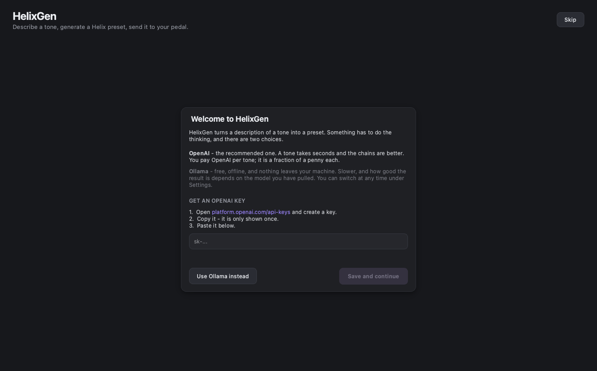

# Using HelixGen

Describe a tone in plain English, look at what came back, and put it on your
pedal. This guide walks through that, start to finish, and then through the
things worth knowing once it works.

---

## 1. What you need

**A Line 6 HX device.** Everything here has been verified on an **HX Stomp**.
Other Helix devices use the same protocol and may well work, but nobody has
confirmed it - if you try one, please
[say so](https://github.com/ORogers/HelixPy/issues/new/choose).

**HX Edit**, Line 6's own editor, [free from Line 6][hxedit]. HelixGen reads two
data files out of it. They are Line 6's to distribute, not ours, so HelixGen
cannot ship them - which is why the app needs HX Edit installed to talk to your
pedal at all. Generating and inspecting presets works without it.

[hxedit]: https://line6.com/software/

**A language model**, one of:

- **An OpenAI API key** - the default, and the one to start with. A tone takes
  seconds and the chains are better. You pay OpenAI per tone; it is a fraction
  of a penny each. The app walks you through this the first time it opens.
- **Ollama**, running on your own machine. Free, offline, no account, and
  nothing leaves your machine. Slower, and how good the result is depends on
  the model you pull.

You only need one, and you can switch at any time under Settings.

---

## 2. Install

Either the app:

1. Download the `.dmg` from [Releases][releases] and drag HelixGen to
   Applications.
2. **Right-click it and choose Open** the first time. See
   [install.md](install.md) for why macOS asks.

[releases]: https://github.com/ORogers/HelixPy/releases

Or the command line:

```bash
pipx install helixgen
```

`pipx install 'helixgen[usb]'` adds the USB stack, and needs libusb
(`brew install libusb`). The `.dmg` carries its own copy.

### Setting up OpenAI

The first time the app opens it asks for a key, with a link to where you make
one. Paste it in and press **Save and continue**; it is checked against the API
before you go any further.



To set or change one later: **Settings › API key**.

The key is saved to a config file in your home directory, readable only by you:

| | |
| --- | --- |
| macOS | `~/Library/Application Support/HelixGen/config.json` |
| Linux | `~/.config/helixgen/config.json` |

It is stored in plain text, the same as the `.env` file the CLI reads, so
anything running as you can read it. Delete the `openai_api_key` entry, or
clear the field in Settings, to remove it.

For the command line, `OPENAI_API_KEY` in your environment or a `.env` file
still works and takes precedence over the saved key - handy for using a
different key for one run without changing anything.

```bash
export OPENAI_API_KEY=sk-...
```

### Setting up Ollama instead

Skip this if you are using OpenAI.

```bash
brew install ollama
ollama serve
ollama pull gpt-oss:20b
```

`gpt-oss:20b` is the default, and the one the prompts were tuned against. It
wants about 16 GB of RAM. `ollama pull gpt-oss:120b` is better if your machine
can hold it. `helixgen llm-models` lists what you have installed and the thinking
levels each one supports.

---

## 3. Back up first

HelixGen overwrites the slot you point it at. Before the first write, take a
copy of everything:

```bash
helixgen backup --output ~/helix-backup
```

That sweeps all 126 slots and writes them out. It reads only; nothing is sent
to the pedal. Do it once and you can experiment freely.

To restore a slot later, `helixgen push` the file you saved back to it.

---

## 4. Your first tone

Open the app (or run `helixgen-ui`). The window has three parts: your pedal's slots
on the left, the tone you are describing down the middle, and upload on the
right, with the generated chain across the bottom.


1. **Check the device.** The left panel names your pedal if it is plugged in.
   Press **Refresh** to read what is in the first few slots - each one is a
   read off the pedal, so it takes a moment.

2. **Pick a slot.** Click the one you are willing to overwrite. Nothing is
   written until you upload, but the upload will not start without a slot
   chosen: it must never guess one.

3. **Describe the tone.** One or two sentences, in the words you would use to
   another guitarist:

   > warm, dark jazz tone - hollowbody into a small valve amp, light compression,
   > a short room reverb, nothing modern

4. **Generate.** Two things happen, and the panel shows both. First the model
   picks the blocks; then a second call sets every parameter across the whole
   chain at once, so it can balance gain and levels rather than tuning each
   block blind. A few seconds on OpenAI, tens of seconds on Ollama.

5. **Read the preview.** The chain appears in signal order, block by block.
   This is the point to notice that it gave you a high-gain amp for a jazz
   tone. Rewording and regenerating costs one more run.

6. **Upload.** The button sends the preset to the slot you chose and
   overwrites it. Your pedal jumps to the new preset. Play it.

If "Upload after generating" is ticked, step 6 happens on its own as soon as a
tone is generated - but still only into a slot you picked.

### The same thing from the command line

```bash
helixgen describe "warm dark jazz tone, hollowbody into a small valve amp"
helixgen describe "tight prog metal rhythm" --upload --upload-via usb --slot 4
```

Without `--output`, the preset lands in `./generated-presets/`.

---

## 5. Writing a good tone prompt

The model is choosing from the real catalog - 343 models, named and grouped -
and then setting their controls. Some things help:

**Name the sound, not the blocks.** "Spacious ambient clean, long decay" gets
further than "add a reverb". The catalog is the model's to search; the sound is
yours to describe.

**Reference records and rigs.** The catalog knows what each model is based on,
so "Gilmour-ish, Big Muff into a Hiwatt" lands well.

**Say what you do not want.** "No modulation", "not scooped", "clean but not
sterile" all steer it.

**Keep the chain short.** An HX Stomp has eight blocks. Ask for less and each
one gets more thought.

Two things the model does not control:

- **Cabinets keep their defaults.** Cab controls - mic, distance, angle - rarely
  follow from a description, and an amp brings its own cab with it anyway.
- **Anything outside the catalog.** The response is constrained to real model
  names and in-range values. A tone it cannot express is refused and re-asked
  once, with the reason attached, rather than being fudged into something the
  pedal would reject.

---

## 6. Ollama or OpenAI

| | OpenAI *(default)* | Ollama |
| --- | --- | --- |
| Cost | A fraction of a penny per tone | Free |
| Speed | Seconds | Tens of seconds |
| Privacy | Your prompt goes to OpenAI | Nothing leaves your machine |
| Quality | Generally better chains | Depends on the model you pull |
| Setup | An API key | Install it, pull a model |

Both are chosen in **Settings**, or with `--llm-backend` on the command line.
Ollama is the one to use offline, on a metered connection, or when a prompt
should not leave the building.

**Thinking level** is the other lever. Higher means the model reasons longer
before answering: slower, usually better. `low` is the default and is normally
enough. Ollama models support fewer levels than OpenAI's, and the nearest
supported one is used automatically.

---

## 7. When something goes wrong

**"HX Edit was not found", and Upload is disabled.** HelixGen could not find an
HX Edit install to read `Helix.sym` from. Install it, or point at it under
**Settings › HX Edit › Locate…** if you keep it somewhere unusual. On the
command line, `helixgen --hx-edit /path/to/HX\ Edit.app`, or set
`HELIXGEN_HX_EDIT`.

**No device listed.** Check the USB cable carries data rather than only power,
and that the pedal is on. `helixgen devices` says what is visible. If HX Edit
itself is open, close it - both want the same interface.

**The pedal's front panel stops responding.** A session was dropped without
being closed. Power-cycle the pedal; nothing is lost. If you can reproduce it,
that is worth [a device report](https://github.com/ORogers/HelixPy/issues/new/choose).

**"That key was rejected."** The key was not accepted by OpenAI. Check the
whole of it was copied - they are long, and a partial paste is the usual
cause. It is saved anyway, so you can correct it under **Settings › API key**.

**"No OpenAI API key" when generating.** Nothing is set. Add one under
**Settings › API key**, or switch to Ollama.

**"Couldn't list installed models" in Settings.** The Ollama server is not
running. `ollama serve`.

**The first Ollama run is very slow.** The model is being loaded into memory.
It is kept loaded for thirty minutes afterwards, so the next tone is quicker.

**Validation errors after generating.** The model produced something the
catalog rejects and could not fix it on a second attempt. Nothing was written.
Reword and try again; if it keeps happening on a particular kind of request,
that is a bug worth reporting.

---

## 8. Beyond the app

The CLI does everything the app does, plus a few things it does not: reading
presets off the pedal, writing hand-authored chain files, and auditing the
catalog against your HX Edit install. See [cli.md](cli.md).

To understand how any of it works, [application_flow.md](application_flow.md)
traces every path end to end, and [usb_protocol.md](usb_protocol.md) explains
how the device support works.
